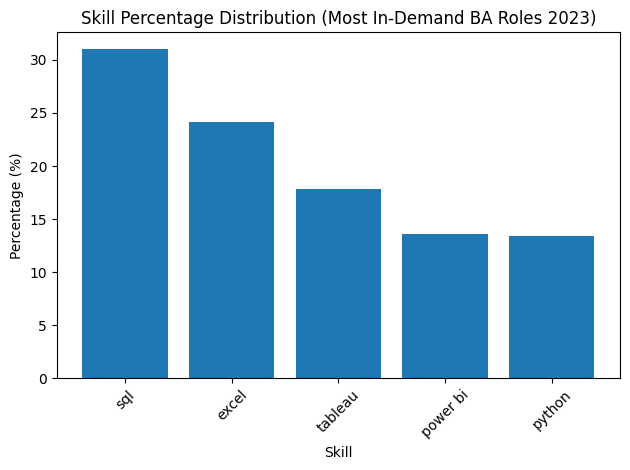
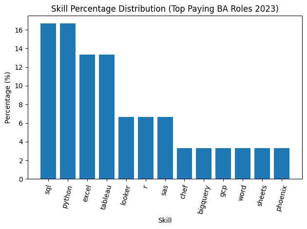
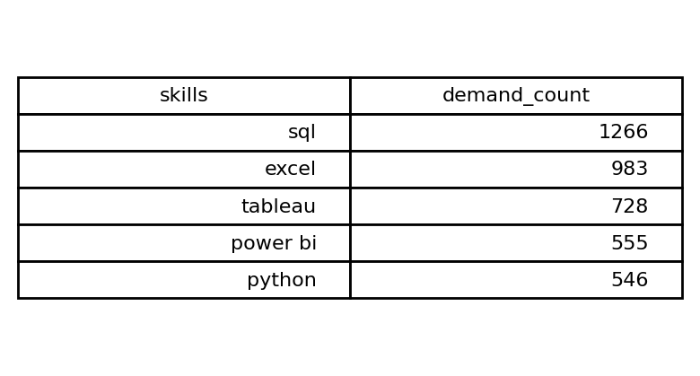
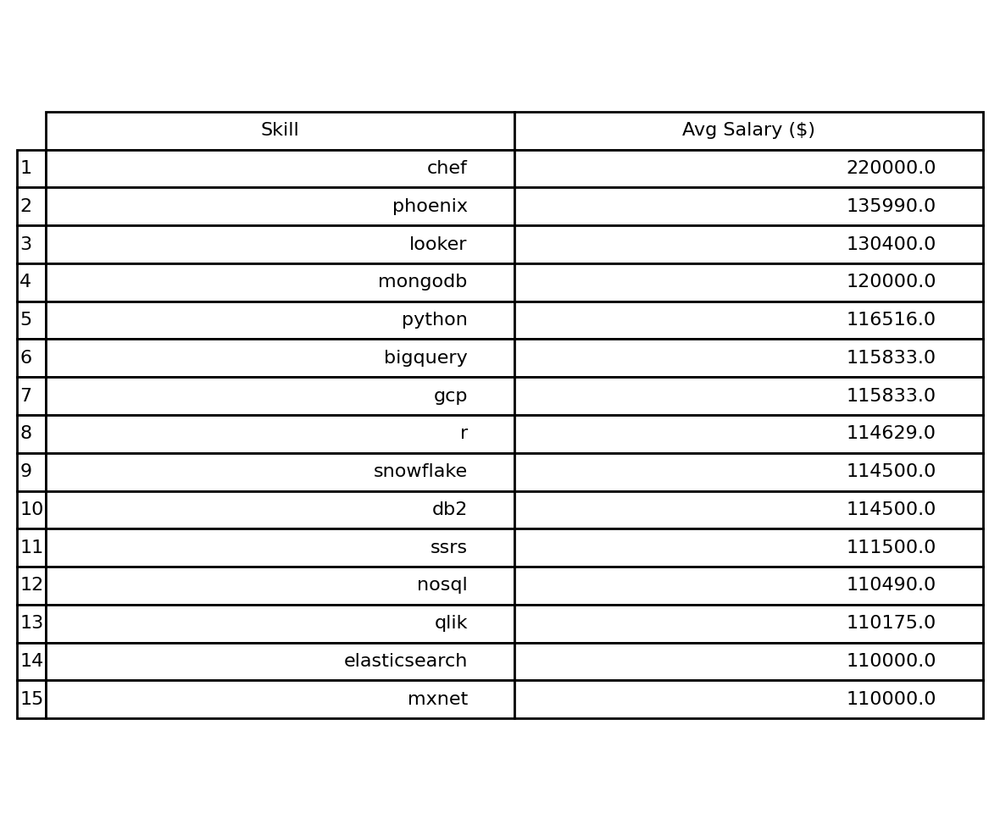
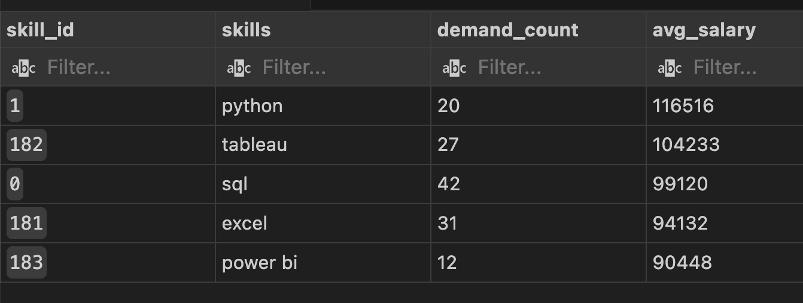

# Introduction
Welcome to my analysis of the Business Analyst job market.
In this study, I explored real job posting data using SQL to better understand what companies are prioritizing today. I examined which skills appear most frequently, which ones command higher salaries, and where demand and compensation overlap.
The goal was to move beyond assumptions and uncover clear, data-backed trends about what drives value in modern Business Analyst roles.
You can review the full SQL analysis here: [project_sql ](/project_sql/)
# Background
Driven by a desire to better understand the Business analyst job market, I conducted this analysis to identify which skills truly drive demand and compensation. Rather than relying on general advice, I wanted to examine real job posting data to uncover clear, measurable patterns around pay and skill requirements.
The dataset includes detailed information on job titles, salaries, locations, and required skills, allowing for a structured exploration of market trends.

### The questions I wanted to answer through my analysis and SQL queries were:
1. What are the top-paying data analyst roles?
2. What skills are required for these high-paying positions?
3. Which skills appear most frequently across job postings?
4. Which skills are associated with higher Business Analyst salaries?
5. What combination of skills offers the strongest market advantage or most optimal skills to learn?


# Tools I Used
For my deep dive into the Business Analyst job market, I relied on a focused set of tools to conduct and organize the analysis:

- **SQL:** The core of my workflow, used to query the dataset and extract meaningful insights from job posting data.
- **PostgreSQL:** The database system used to manage and structure the data efficiently throughout the analysis process.
- **Visual Studio Code:** My primary environment for writing, testing, and executing SQL queries.
- **Git & GitHub:** Used for version control and documentation, allowing me to track changes and maintain a structured record of my SQL analysis.
# The Analysis
Each query in this analysis was designed to explore a specific dimension of the Business Analyst job market. Rather than running generic queries, I structured each one to answer a targeted question and uncover meaningful patterns within the data.
Here’s how I approached each key question:

### 1. Top Paying Business Analyst Jobs
To identify the highest paying roles, I filtered Business Analyst positions based on average annual salary and location, with a specific focus on remote opportunities. This approach allowed me to isolate premium roles and better understand where the highest paying compensation exists within the market.

```sql
    SELECT 
        job_id,
        job_title,
        job_location,
        job_schedule_type,
        salary_year_avg,
        job_posted_date,
        name AS company_name
    FROM 
        job_postings_fact
    LEFT JOIN  
        company_dim ON job_postings_fact.company_id = company_dim.company_id
    WHERE 
        job_title_short = 'Business Analyst' AND 
        job_location = 'Anywhere' AND
        salary_year_avg IS NOT NULL
    ORDER BY 
        salary_year_avg DESC
    LIMIT 10;
```
Here’s a breakdown of the top Business Analyst roles in 2023:
- **Wide Salary Range:** The top 10 Business Analyst roles range roughly from $134,000 to $220,000, highlighting substantial earning potential, particularly in senior and leadership-focused positions.
- **Leadership & Strategy Oriented Roles:**
Many of the highest-paying positions include titles such as Lead, Manager, Senior, and Staff, indicating that compensation increases significantly when business analysis responsibilities expand into strategy, operations, or decision-making leadership.
- **Job Title Variety:**
Several roles blend analytics with business intelligence, revenue operations, marketing analytics, and applied science. This reflects a trend where top-paying Business Analyst positions require cross-functional impact and a stronger technical foundation beyond traditional reporting.


*Bar graphs visualising the salary for the top 10 salaries for Business analyst; ChatGPT generated this graph from my SQL query results*

### 2. Skills for Top Paying Jobs
To determine the skills tied to top paying Business Analyst jobs, I combined job posting data with skill-level information. This approach highlights the capabilities employers consistently value in high compensation Business Analyst roles.

```sql
WITH top_paying_jobs AS (
        SELECT 
            job_id,
            job_title,
            salary_year_avg,
            name AS company_name
        FROM 
            job_postings_fact
        LEFT JOIN  
            company_dim ON job_postings_fact.company_id = company_dim.company_id
        WHERE 
            job_title_short = 'Business Analyst' AND 
            job_location = 'Anywhere' AND
            salary_year_avg IS NOT NULL
        ORDER BY 
            salary_year_avg DESC
        LIMIT 10
 )

 SELECT top_paying_jobs.*,
 skills 
 FROM top_paying_jobs
 INNER JOIN skills_job_dim ON top_paying_jobs.job_id = skills_job_dim.job_id
 INNER JOIN skills_dim ON skills_job_dim.skill_id = skills_dim.skill_id 
 ORDER BY salary_year_avg DESC;
 ```

 Here’s the breakdown of the most demanded skills for the top 10 highest paying Business Analyst roles in 2023:
**SQL** is leading with a bold count of 5.
**Python** follows closely with a bold count of 5.
**Excel and Tableau** are also highly sought after, each with a bold count of 4.
**Other skills like Looker, R, and SAS** show moderate demand, while tools such as BigQuery, GCP, **Chef, Word, Sheets, and Phoenix** appear with lower frequency.


*Bar graph visualizing the count of skills for the top 10 paying jobs for Business analysts; 
ChatGPT generated this graph from my SQL query results*

### 3. Top Demanded Skills for Business Analysts
This query helped identify the skills most frequently requested in job postings, directing focus to areas with high demand.

```sql
SELECT 
    skills,
    COUNT(skills_job_dim.job_id) AS demand_count
 FROM job_postings_fact
 INNER JOIN skills_job_dim ON job_postings_fact.job_id = skills_job_dim.job_id
 INNER JOIN skills_dim ON skills_job_dim.skill_id = skills_dim.skill_id 
 WHERE 
    job_title_short = 'Business Analyst' 
    AND job_work_from_home = TRUE
 GROUP BY 
    skills 
 ORDER BY 
    demand_count DESC
 LIMIT 5;
 ```
 Here's the breakdown of the most demanded skills for data analysts in 2023:
 - **SQL and Python** form the technical foundation, each appearing most frequently across the highest-paying roles. This highlights the importance of strong querying capabilities combined with programming skills for advanced analysis and automation.
- **Excel and Tableau** remain highly relevant, reinforcing that reporting, dashboarding, and stakeholder communication are still core expectations in premium Business Analyst positions.
- **Specialized and cloud-related tools such as Looker, BigQuery, GCP, R, and SAS** appear less frequently but signal added value, suggesting that technical depth and ecosystem familiarity act as differentiators in high-compensation roles rather than baseline requirements.

*Table of the demand for the top 5 skills in Business analyst job postings*

### 4. Skills Based on Salary

Exploring the average salaries associated with different skills revealed which skills are the highest paying.

```sql
SELECT 
    skills,
    ROUND(AVG(salary_year_avg),0) AS avg_salary
 FROM job_postings_fact
 INNER JOIN skills_job_dim ON job_postings_fact.job_id = skills_job_dim.job_id
 INNER JOIN skills_dim ON skills_job_dim.skill_id = skills_dim.skill_id 
 WHERE
     job_title_short = 'Business Analyst' 
      AND salary_year_avg IS NOT NULL 
      AND job_work_from_home =TRUE 
 GROUP BY 
      skills 
 ORDER BY
       avg_salary DESC
 LIMIT 25;
 ```
Breakdown of Top Paying Skills for Business Analysts:
- **Cloud & Data Platform Expertise Pays More:**
Skills like BigQuery, GCP, Snowflake, and Databricks show that Business Analysts working within modern cloud ecosystems earn higher salaries.
- **Advanced Analytics Increases Salary Ceiling:**
Technical skills such as Python and R signal stronger analytical capability and are consistently associated with premium compensation.
- **Modern BI & Data Integration Matter:**
Tools like Looker, MongoDB, and Qlik indicate that analysts who operate within integrated data environments and cross-functional systems are positioned in higher-paying roles.


*Table of the average salary for the top paying skills for Business analysts*


### 5. Most Optimal Skills to Learn 
Combining insights from demand and salary data, this query aimed to pinpoint skills that are both in high demand and have high salaries, offering a strategic focus for skill development.

```sql
SELECT 
    skills_dim.skill_id,
    skills_dim.skills,
    COUNT(skills_job_dim.job_id) AS demand_count,
    ROUND(AVG(salary_year_avg),0) AS avg_salary
 FROM job_postings_fact
 INNER JOIN skills_job_dim ON job_postings_fact.job_id = skills_job_dim.job_id
 INNER JOIN skills_dim ON skills_job_dim.skill_id = skills_dim.skill_id 
 WHERE
     job_title_short = 'Business Analyst' 
      AND salary_year_avg IS NOT NULL 
      AND job_work_from_home =TRUE 
 GROUP BY 
      skills_dim.skill_id
 HAVING COUNT(skills_job_dim.job_id) > 10
 ORDER BY
       avg_salary DESC,
       demand_count DESC
 LIMIT 25;
 ```

 Breakdown of High-Demand & High-Paying Business Analyst Skills:
- **SQL Remains the Core Power Skill:**
With the highest demand (42) and strong salary levels, SQL stands out as the most valuable foundational skill for Business Analysts.
- **Excel & Tableau Drive Business Reporting Strength:**
Excel (31 demand) and Tableau (27 demand) show that strong reporting, dashboarding, and business communication capabilities remain highly marketable.
- **Python Adds Salary Upside:**
Although lower in demand than SQL or Excel, Python carries the highest average salary among the group, indicating that technical depth increases earning potential.


*Table of the most optimal skills for Business analyst sorted by salary

### What I Learned

Throughout this analysis, I significantly strengthened both my SQL expertise and analytical approach:
- **Advanced Query Design:**
Built complex queries using joins, CTEs, and subqueries to transform raw job data into structured, decision-ready insights.
- **Data Aggregation & Insight Extraction:**
Applied GROUP BY, aggregate functions, and filtering techniques to uncover meaningful trends in salary, demand, and skill alignment.
- **Strategic Analytical Thinking:**
Translated business-focused questions into measurable SQL logic, identifying patterns that reveal what truly drives value in the Business Analyst job market.

### Conclusions

# Key Insights for Business Analyst (2023)
- **1. Top-Paying Roles:**
BA and BI leadership roles reach up to $220K, showing strong upside at senior levels.
- **2. Skills for Top-Paying Jobs:**
High-paying roles consistently require SQL, Python, Tableau, and Excel — technical depth drives compensation.
- **3. Most In-Demand Skills:**
SQL and Excel dominate market demand, with Tableau, Power BI, and Python close behind.
- **4. Skills Linked to Higher Salaries:**
Cloud and modern data tools like BigQuery, GCP, and Snowflake correlate with higher salary brackets.
- **5. Most Optimal Skill:**
SQL stands out — highest demand with strong pay, making it the most strategic skill for Business Analysts.

### Closing Thoughts
This analysis sharpened my SQL skills while uncovering clear trends in the Business Analyst job market. The results highlight which skills drive both demand and higher compensation, providing a focused direction for career growth.
For Business Analysts, strengthening core data skills and adapting to evolving analytics tools is key to staying competitive and maximizing market value.